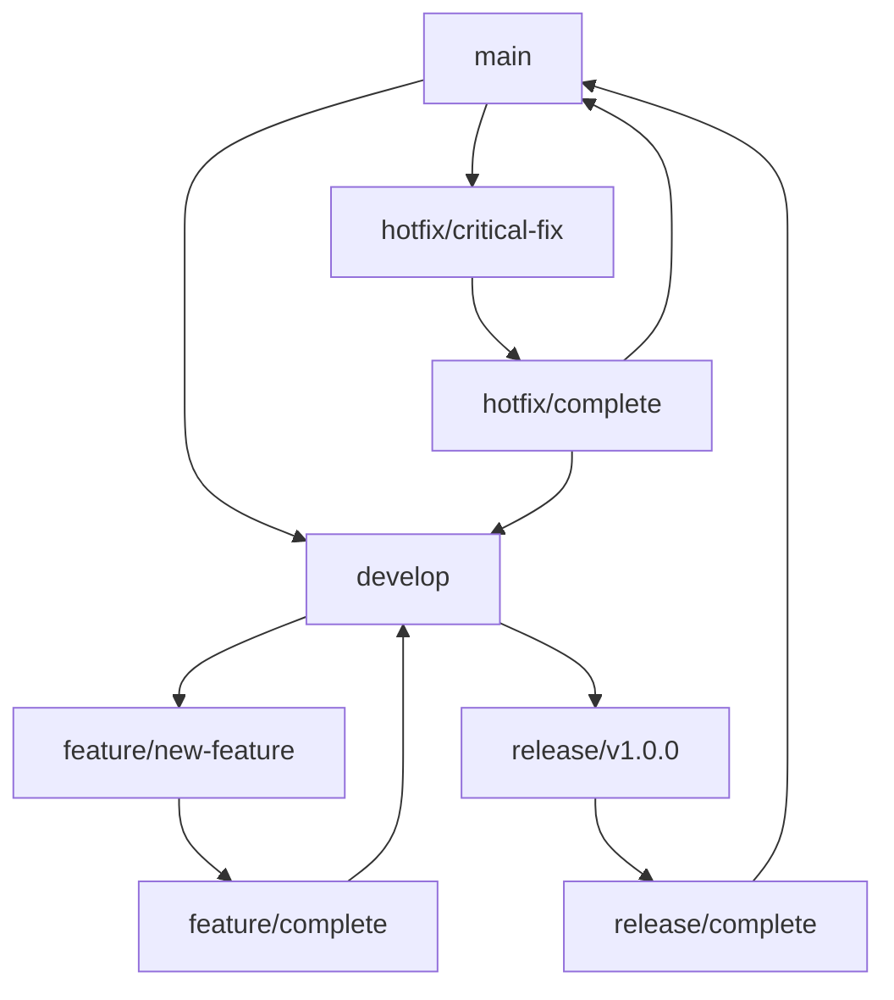

# Git Workflow Guide

This document outlines the Git workflow and branching strategy for the Handicrafts E-commerce Frontend project.

## 🌳 Branching Strategy

We follow the **Git Flow** branching model with some modifications:

### Main Branches

- **`main`**: Production-ready code
- **`develop`**: Integration branch for features

### Supporting Branches

- **`feature/*`**: New features
- **`bugfix/*`**: Bug fixes
- **`hotfix/*`**: Critical production fixes
- **`release/*`**: Release preparation

## 🚀 Workflow Overview



## 📋 Branch Naming Conventions

### Feature Branches
```
feature/description-of-feature
feature/payment-integration
feature/user-authentication
feature/admin-dashboard
```

### Bug Fix Branches
```
bugfix/description-of-bug
bugfix/cart-item-removal
bugfix/payment-validation
bugfix/responsive-layout
```

### Hotfix Branches
```
hotfix/critical-security-issue
hotfix/payment-processing-error
hotfix/data-loss-prevention
```

### Release Branches
```
release/v1.0.0
release/v1.1.0
release/v2.0.0
```

## 🔄 Development Workflow

### 1. Starting a New Feature

```bash
# Switch to develop branch
git checkout develop

# Pull latest changes
git pull origin develop

# Create feature branch
git checkout -b feature/payment-integration

# Start development...
```

### 2. Working on a Feature

```bash
# Make changes and commit frequently
git add .
git commit -m "feat(payment): add Razorpay integration"

# Push feature branch
git push origin feature/payment-integration
```

### 3. Completing a Feature

```bash
# Ensure feature is up to date
git checkout develop
git pull origin develop
git checkout feature/payment-integration
git rebase develop

# Push updated feature branch
git push origin feature/payment-integration

# Create Pull Request to develop branch
```

### 4. Bug Fix Workflow

```bash
# Create bugfix branch from develop
git checkout develop
git checkout -b bugfix/cart-item-removal

# Fix the bug
git add .
git commit -m "fix(cart): resolve item removal issue"

# Push and create PR
git push origin bugfix/cart-item-removal
```

### 5. Hotfix Workflow

```bash
# Create hotfix branch from main
git checkout main
git checkout -b hotfix/critical-security-issue

# Fix the issue
git add .
git commit -m "hotfix(security): patch critical vulnerability"

# Push and create PR to main
git push origin hotfix/critical-security-issue

# After merge, merge back to develop
git checkout develop
git merge main
git push origin develop
```

## 📝 Commit Message Guidelines

### Format
```
type(scope): description

[optional body]

[optional footer]
```

### Types
- **`feat`**: New feature
- **`fix`**: Bug fix
- **`docs`**: Documentation changes
- **`style`**: Code style changes (formatting, etc.)
- **`refactor`**: Code refactoring
- **`test`**: Adding or updating tests
- **`chore`**: Maintenance tasks
- **`perf`**: Performance improvements
- **`ci`**: CI/CD changes
- **`build`**: Build system changes

### Scopes
- **`auth`**: Authentication related
- **`payment`**: Payment processing
- **`cart`**: Shopping cart
- **`product`**: Product management
- **`order`**: Order management
- **`admin`**: Admin dashboard
- **`ui`**: User interface
- **`api`**: API related
- **`config`**: Configuration

### Examples
```bash
feat(payment): add Razorpay integration
fix(cart): resolve item quantity update issue
docs(readme): update installation instructions
refactor(auth): simplify authentication flow
test(payment): add payment validation tests
chore(deps): update dependencies
perf(ui): optimize component rendering
```

## 🔀 Pull Request Guidelines

### PR Title Format
```
type(scope): brief description
```

### PR Description Template
```markdown
## Description
Brief description of changes

## Type of Change
- [ ] Bug fix
- [ ] New feature
- [ ] Breaking change
- [ ] Documentation update

## Testing
- [ ] Unit tests pass
- [ ] Integration tests pass
- [ ] Manual testing completed

## Checklist
- [ ] Code follows project style guidelines
- [ ] Self-review completed
- [ ] Documentation updated
- [ ] No breaking changes (or documented)

## Screenshots (if applicable)
[Add screenshots here]

## Related Issues
Closes #123
```

## 🏷️ Tagging Strategy

### Version Tags
```bash
# Create version tag
git tag -a v1.0.0 -m "Release version 1.0.0"
git push origin v1.0.0
```

### Tag Naming
- **Major releases**: `v1.0.0`, `v2.0.0`
- **Minor releases**: `v1.1.0`, `v1.2.0`
- **Patch releases**: `v1.0.1`, `v1.0.2`
- **Pre-releases**: `v1.0.0-beta.1`, `v1.0.0-rc.1`

## 🛠️ Git Aliases

### Useful Aliases
```bash
# Basic aliases
git config --local alias.co checkout
git config --local alias.br branch
git config --local alias.ci commit
git config --local alias.st status

# Advanced aliases
git config --local alias.unstage 'reset HEAD --'
git config --local alias.last 'log -1 HEAD'
git config --local alias.visual '!gitk'
git config --local alias.lg 'log --oneline --graph --decorate --all'
```

### Custom Aliases for This Project
```bash
# Feature branch creation
git config --local alias.fb '!f() { git checkout develop && git pull origin develop && git checkout -b feature/$1; }; f'

# Bug fix branch creation
git config --local alias.bb '!f() { git checkout develop && git pull origin develop && git checkout -b bugfix/$1; }; f'

# Hotfix branch creation
git config --local alias.hb '!f() { git checkout main && git pull origin main && git checkout -b hotfix/$1; }; f'
```

## 🔒 Security Considerations

### Sensitive Data
- Never commit API keys, passwords, or secrets
- Use environment variables for sensitive configuration
- Review `.gitignore` regularly
- Use Git hooks to prevent accidental commits of sensitive data

### Pre-commit Hooks
```bash
# Install pre-commit hooks
npm install --save-dev husky lint-staged

# Configure in package.json
{
  "husky": {
    "hooks": {
      "pre-commit": "lint-staged"
    }
  },
  "lint-staged": {
    "*.{js,jsx,ts,tsx}": ["eslint --fix", "git add"],
    "*.{css,scss,md}": ["prettier --write", "git add"]
  }
}
```

## 📊 Branch Protection Rules

### Main Branch Protection
- Require pull request reviews
- Require status checks to pass
- Require branches to be up to date
- Restrict pushes to main branch

### Develop Branch Protection
- Require pull request reviews
- Require status checks to pass
- Allow force pushes (for rebasing)

## 🚨 Emergency Procedures

### Reverting a Commit
```bash
# Revert a specific commit
git revert <commit-hash>

# Revert a merge commit
git revert -m 1 <merge-commit-hash>
```

### Resetting a Branch
```bash
# Soft reset (keeps changes in working directory)
git reset --soft HEAD~1

# Hard reset (discards all changes)
git reset --hard HEAD~1
```

### Recovering Lost Commits
```bash
# Find lost commits
git reflog

# Recover specific commit
git checkout <commit-hash>
git checkout -b recovery-branch
```

## 📚 Resources

- [Git Flow Documentation](https://nvie.com/posts/a-successful-git-branching-model/)
- [Conventional Commits](https://www.conventionalcommits.org/)
- [GitHub Flow](https://guides.github.com/introduction/flow/)
- [Git Best Practices](https://git-scm.com/docs/gitworkflows)

## 🤝 Team Guidelines

### Code Review Process
1. **Self Review**: Review your own code before creating PR
2. **Peer Review**: At least one team member must review
3. **Testing**: Ensure all tests pass
4. **Documentation**: Update documentation if needed

### Communication
- Use descriptive commit messages
- Provide context in PR descriptions
- Tag relevant team members for reviews
- Use GitHub issues for bug tracking

### Conflict Resolution
- Rebase feature branches before merging
- Resolve conflicts promptly
- Communicate with team about complex conflicts
- Test thoroughly after resolving conflicts
